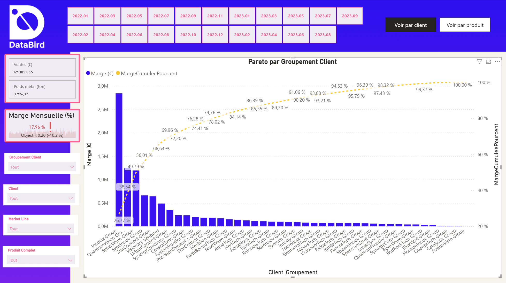

# Cas Fil Rouge — Dashboard Power BI pour une usine de câbles

Dashboard de pilotage de la rentabilité pour une usine de câbles : marge globale de **21,52 %**, objectif de 20 % dépassé de +7,6 points — et le segment qui plombe la moyenne clairement identifié.

## Contexte

L'équipe commerciale d'une usine de fabrication de câbles n'a pas de vision consolidée sur sa facturation. Elle a besoin d'un dashboard interactif pour trois choses : suivre la facturation, évaluer la rentabilité (marge), et identifier les clients et produits les plus rentables.

Données de départ : deux extractions de facturation (2022 et 2023), un référentiel clients, un référentiel produits, et une table de correspondance route commerciale → marché (Market Line).

## Démarche

**Nettoyage et préparation (Power Query)** — 4 requêtes construites : `FactFacturation` (combinaison 2022+2023), `DimClients`, `DimProduits`, mapping Market Line. Colonnes inutiles supprimées, types corrigés, colonne `Marge Commerciale %` ajoutée.
Un bug de jointure a été rencontré sur la clé client : certains codes client étaient mal formatés dans la source (segment final avec zéro non significatif perdu à la conversion). Correction en deux étapes en Power Query (isolation du segment, reconstruction du code) pour fiabiliser la relation avec le référentiel clients.

**Modélisation en étoile** — table de faits `FactFacturation` reliée à `DimClients`, `DimProduits` et `DimCalendar`. Colonnes calculées `Client_Complet` et `Produit_Complet` (numéro + nom) pour un affichage lisible dans les visuels.

**Mesures DAX** — Ventes (€), Marge (€), Marge (%), Poids métal (tonnes), plus un KPI de marge avec objectif dynamique. Piège rencontré : le KPI restait vide dès qu'une cible fixe était ajoutée, à cause d'une incohérence entre une mesure de marge qui peut être vide (aucune vente ce jour-là) et une cible constante qui, elle, ne l'est jamais. Résolu avec une cible conditionnelle (`IF(ISBLANK([Ventes (€)]), BLANK(), 0.2)`) qui devient vide exactement quand la marge l'est.

**Analyse Pareto** — courbe de marge cumulée par groupement client, avec deux mesures DAX (`RANKX` + `TOPN` pour classer et cumuler, `ALLSELECTED` pour que le calcul reste juste même quand on filtre avec les segments).

**Sécurité des données** — trois rôles de sécurité au niveau ligne (RLS) : `Domestique` et `LAN` (chaque commercial ne voit que son marché), plus un rôle `OLS` qui masque la colonne quantité pour les profils qui n'ont pas à la voir.

**Déploiement** — rapport publié sur Power BI Service, dashboard avec 3 tuiles épinglées, et un rapport paginé (export imprimable) pour la direction.

## Résultats

- **Marge globale : 21,52 %**, contre un objectif de 20 % — objectif dépassé de +7,6 points.
- **Concentration client forte** : 11 groupements clients sur 39 (28 %) génèrent à eux seuls 80 % de la marge totale. Les 3 premiers (représentant environ 8 % des clients) pèsent déjà plus de la moitié de la marge.
- **Le point faible n'est pas généralisé, il est localisé** : le segment Domestique ne dégage que 12,9 % de marge, loin derrière Fibre Optique (26,3 %, le meilleur segment) — c'est lui qui tire la moyenne globale vers le bas.

## Recommandations

- Investiguer en priorité la rentabilité du segment **Domestique** (12,9 % de marge) : structure de coûts, politique tarifaire ou remises accordées sur ce marché.
- Sécuriser la relation commerciale avec les 3 principaux groupements clients (51 % de la marge à eux seuls) : une perte sur l'un d'eux aurait un impact disproportionné.
- Orienter les efforts commerciaux vers le mix **Fibre Optique**, déjà le segment le plus rentable, si la demande le permet.

## Outils

Power Query · Modèle en étoile · DAX (mesures, RANKX/TOPN, ALLSELECTED) · RLS/OLS · Power BI Service (rapport, dashboard, rapport paginé)

## Limites

Analyse basée sur 2 515 lignes de facturation (2022-2023). 2 codes client sur 48 n'ont pas pu être rapprochés du référentiel malgré la correction de clé (6,4 % des lignes) — écart marginal sans impact sur les grandes masses ci-dessus.

---
*Projet réalisé dans le cadre de la formation Data Analyst DataBird.*
